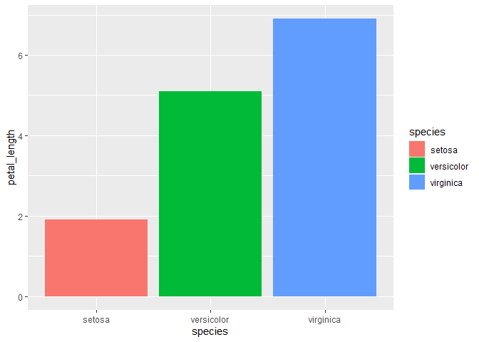

ggplot2_intro_color
================
Grace Deitzler
2024-05-06

## Introduction to using ggplot2

### What is ggplot?

ggplot2, or ‘grammar of graphics’ plot, is a package in R that can be
used to make elegant and highly customizable data visualizations.

You provide ggplot with data, and use ggplot syntax to map variables
from that data to aesthetics. You create ggplot in layers, and this way
you can easily add things like colors, titles, plot types, axis text,
orientations, and myriad other specifications.

ggplot2 has a fairly steep learning curve, but once you get the basics
down, you can begin to make beautiful and informative plots.

The R for Data Science book has a great primer on getting started with
ggplot: <https://r4ds.had.co.nz/data-visualisation.html>

ggplot2 cheat sheet for quick reference:
<https://www.maths.usyd.edu.au/u/UG/SM/STAT3022/r/current/Misc/data-visualization-2.1.pdf>

## First steps

Set your working directory to the folder that contains this file and the
iris csv.

## ggplot2 basics

Let’s make a very simple plot using the iris dataset.The iris dataset
contains observational data about sepal and petal length and width of
three different iris species.

``` r
iris <- read.csv("iris.csv")

#check it out

head(iris) #this looks at the first five columns
```

    ##   sepal_length sepal_width petal_length petal_width species
    ## 1          5.1         3.5          1.4         0.2  setosa
    ## 2          4.9         3.0          1.4         0.2  setosa
    ## 3          4.7         3.2          1.3         0.2  setosa
    ## 4          4.6         3.1          1.5         0.2  setosa
    ## 5          5.0         3.6          1.4         0.2  setosa
    ## 6          5.4         3.9          1.7         0.4  setosa

``` r
View(iris)
```

Starting with a basic barplot.

Barplots are useful for plotting discrete data (for example, comparing
the petal length of three different species of iris.)

``` r
library("ggplot2")
ggplot(iris) + #here, we are calling the ggplot function and giving it the iris dataset
  geom_bar(aes(x = species, y = petal_length, fill = species), #now, we add on the layer that specifies that you want to make a barplot, and which variables you want for your x and y axis
           stat = "identity", position = "dodge") #this line is specific to the geom_bar function - some plot types have ways you can further customize them in a separate layer
```

<!-- -->

A few more types of plots we can make with Iris:

geom_point can be used to make scatter plots, such as this one comparing
the correlation between sepal length and sepal width

``` r
ggplot(data=iris,aes(x=sepal_width, y=sepal_length,color=species)) + geom_point()
```

<!-- -->
Adding on geom_jitter will help stagger things a little more

``` r
ggplot(data=iris,aes(x=sepal_width, y=sepal_length,color=species)) + geom_point() + geom_jitter()
```

<!-- -->
We can make a histogram, counting the number of samples of eaach species
with a given sepal length

``` r
ggplot(data=iris,aes(x=sepal_length,fill=species)) + geom_histogram()
```

    ## `stat_bin()` using `bins = 30`. Pick better value with `binwidth`.

<!-- -->
We could also make a density plot…

``` r
ggplot(data=iris,aes(x=sepal_length,color=species)) + geom_density()
```

<!-- -->
\## Faceting

Faceting can allow you to look at a lot of data next to each other in a
more easy-to-read manner, by using facets to separate groups.

``` r
sepal_width <- ggplot(data=iris,aes(x=sepal_width, y=sepal_length,color=species)) + 
  geom_point() +
  facet_wrap(~species)
sepal_width
```

<!-- -->

``` r
ggsave("sepal_width.png", plot = sepal_width)
```

    ## Saving 7 x 5 in image

Now for some fun stuff…

## Making a Custom Color Palette

I like to start by generating a palette using a website like coolors.co.

Before deciding on a palette, check to make sure that your selected
colors can be easily seen by those with colorblindness. You can use the
Coblis website
<https://www.color-blindness.com/coblis-color-blindness-simulator/> to
upload a screenshot of your chosen color palette to see how it will look
with different kinds of colorblindness.

Once you have your palette in mind, copy and paste the color names and
hex codes, which we will store as a list, and then create a function to
call the colors in the list.

``` r
#named vector of hex codes
my_colors <- c('Yellow Orange' = "#FFA630",
                    'Tea Green' = "#D7E8BA",
                    'Cadet Blue' = "#4DA1A9",
                    'Coral' = "#EF6F6C",
                    'Sage' = "#BBC385",
                    'Hyacinth' = '#94579E'
                  
                    
)
#function to access the colors
my_cols <- function(...) {
  cols <- c(...)
  
  if (is.null(cols))
    return (my_colors)
  
  my_colors[cols]
}

#test - does the function work?

my_cols("Sage")
```

    ##      Sage 
    ## "#BBC385"

``` r
#named lists of different palettes - which are all combinations of the colors we named above
my_palette <- list(
  'main' = my_cols("Yellow Orange", "Coral", "Cadet Blue"),
  'two' = my_cols("Hyacinth", "Sage"),
  'three' = my_cols("Hyacinth", "Sage", "Tea Green")
)

# now a function to access the palettes above
my_pal <- function(palette = "main", reverse = FALSE, ...) {
  pal <- my_palette[[palette]]
  
  if (reverse) pal <- rev(pal)
  
  colorRampPalette(pal, ...)
}

#now build ggplot2 compatible scale functions for color and fill that use the palettes
scale_color_mycolors <- function(palette = "main", discrete = TRUE, reverse = FALSE, ...) {
  pal <- my_pal(palette = palette, reverse = reverse)
  
  if (discrete) {
    discrete_scale("colour", paste0("my_", palette), palette = pal, ...)
  } else {
    scale_color_gradientn(colours = pal(256), ...)
  }
}

scale_fill_mycolors <- function(palette = "main", discrete = TRUE, reverse = FALSE, ...) {
  pal <- my_pal(palette = palette, reverse = reverse)
  
  if (discrete) {
    discrete_scale("fill", paste0("my_", palette), palette = pal, ...)
  } else {
    scale_fill_gradientn(colours = pal(256), ...)
  }
}
```

Let’s test it on the Iris dataset.

Let’s add in our colors in place of the default

``` r
ggplot(iris) +
  geom_bar(aes(x = species, y = petal_length, fill = species),
           stat = "identity", position = "dodge") +
  scale_fill_mycolors(palette = "three")
```

<!-- -->

Looks good! Now let’s clean it up a bit: add axis lables/title, increase
the font size to make it more readable. I’m going to remove the axis
lines and ticks just for fun here too.

``` r
# make a bar plot for petal length

ggplot(iris) +
  geom_bar(aes(x = species, y = petal_length, fill = species),
           stat = "identity", position = "dodge") +
  scale_fill_mycolors(palette = "three") +
  theme_classic(base_size = 18) + #changing the grey default scheme as well as increasing the text size
  xlab("Species") +
  ylab("Petal length") +
  theme(axis.text.x = element_text(angle = 45,
                                   hjust = 0, vjust = 0), 
        axis.line = element_blank(), #removing the axis lines
        axis.ticks.x = element_blank()) + #removing the axis ticks along the x axis
          ggtitle("Petal length of iris species") +
  theme(plot.title = element_text(hjust = 0.5)) # center the text
```

<!-- -->

Looks like the color function worked!

## Playing around with themes

Viewing them side by side to get a feel for the differences

``` r
# let's save the above code as an object so we can easily add themes

p <- ggplot(iris) +
  geom_bar(aes(x = species, y = petal_length, fill = species),
           stat = "identity", position = "dodge") +
  scale_fill_mycolors(palette = "three")

p + theme_linedraw() + ggtitle("Linedraw")
```

<!-- -->

``` r
p + theme_light() + ggtitle("Light") # similar to above
```

<!-- -->

``` r
p + theme_void() + ggtitle("Void") #when you want no text, for some reason
```

<!-- -->

``` r
p + theme_classic()+ ggtitle("Classic")
```

<!-- -->

``` r
p + theme_tufte() + ggtitle("ggthemes Tufte") #minimalist, with Times New Roman font
```

<!-- -->

``` r
p + theme_stata() + ggtitle("ggthemes Stata")#I like this one for presentations, very crisp
```

<!-- -->

``` r
p + theme_hc() + ggtitle("ggthemes HC")#another nice one for presentations
```

<!-- -->

``` r
p + theme_economist() + ggtitle("Economist")
```

<!-- -->
If you are putting your plot on a poster and want to custom match the
background, you can alter the background color with panel_background.

here you could also fill in the “\_” with the hex code of your poster
color, which can be obtained by using a color picker in PowerPoint,
Paint, or a similar image editing software.

``` r
p + theme(
  plot.background = element_rect(fill = "lightblue")
)
```

<!-- -->

``` r
# can also change the color of the panel

p + theme(
  plot.background = element_rect(fill = "lightblue"), #plot
  panel.background = element_rect(fill = "lightblue"), #panel
  legend.background = element_rect(fill = "lightblue") #legend
)
```

<!-- -->

Cute!

## Using palettes

I love using palettes inspired by movies and art as a way to introduce
fun bursts of color into my plots.

### MetBrewer

Palettes based on art at the Metropolitan Museum of Art. Includes
several colorblind friendly palettes.

<https://github.com/BlakeRMills/MetBrewer>

``` r
MetBrewer::colorblind_palettes #lists colorblind friendly palettes
```

    ##  [1] "Archambault" "Cassatt1"    "Cassatt2"    "Demuth"      "Derain"     
    ##  [6] "Egypt"       "Greek"       "Hiroshige"   "Hokusai2"    "Hokusai3"   
    ## [11] "Ingres"      "Isfahan1"    "Isfahan2"    "Java"        "Johnson"    
    ## [16] "Kandinsky"   "Morgenstern" "OKeeffe1"    "OKeeffe2"    "Pillement"  
    ## [21] "Tam"         "Troy"        "VanGogh3"    "Veronese"

``` r
met.brewer("Isfahan1") #this one is colorblind friendly and has 8 colors
```

<!-- -->

``` r
met.brewer("OKeeffe1")
```

<!-- -->

``` r
met.brewer("Hokusai2")
```

<!-- -->

Using the MetBrewer package to visualize the percentage of olive oil
fatty acid compounds.

``` r
data("olive")
View(olive) #data on percentage of 8 fatty acids found in the lipid fraction of 572 olive oils
```

This dataset has the percentage of 8 different fatty acids found in the
lipid fraction of 572 olive oils from regions around Italy. We need a
palette that has 8 distinct colors, so I’ve picked the Isfahan1 palette,
which is based on colors found in a beautiful mosaic Mihrab or pray
niche from twelfth century Iran.

``` r
#first tidy the data by making it so the fatty acid types are long form
olive.melt <- reshape2::melt(olive, id = c("region", "area"), #the columns we want as the identifiers - everything else will be transposed into long format
                             value.name = "Percent", #renaming the value column
                             variable.name = "fatty_acid") #renaming the variable column

View(olive.melt)
```

Now that the data is tidied with the melt function, turning it from wide
to long format.

``` r
ggplot(olive.melt, aes(x= fatty_acid, y= Percent, fill = fatty_acid)) + 
  geom_bar(stat = "identity", position = "dodge")+
  xlab("Fatty acid") + 
  ylab( "Percentage") +
  facet_wrap(~region) +
  coord_flip() + #flip it and reverse it
  theme_classic(base_size = 14) +
  theme(axis.text.x = element_text(angle = 45,
                                   hjust = 0, vjust = 0)) +
          ggtitle("Percentage of 8 fatty acids \n in olive oils across Italy") +
  scale_fill_manual(values=met.brewer("Isfahan1")) +
  theme(plot.title = element_text(hjust = 0.5)) # center the text
```

<!-- -->

### Studio Ghibli

This package contains palettes inspired by the colors in 8 different
Studio Ghibli movies, with light and dark variations for each.

<https://github.com/ewenme/ghibli>

``` r
# display palettes with names
par(mfrow=c(9,3))
for(i in names(ghibli_palettes)) print(ghibli_palette(i))
```

<!-- -->

### A few more themes to peruse at your convenience

#### National Parks

25 palettes based on vintage posters by the US Department of the
Interior/National Parks Services.

<https://github.com/katiejolly/nationalparkcolors>

#### ggsci

Color palettes inspired by the color schemes of journals, data viz
libraries, science fiction movies and TV shows such as Rick and Morty
and StarTrek.

<https://cran.r-project.org/web/packages/ggsci/vignettes/ggsci.html>

#### ggthemes

Used earlier for our themes, ggthemes also has its own built-in color
palettes, based on such things as Excel, Stata, the Economist, the Wall
Street Journal, and more.

#### LaCroix

Palettes for every flavor of your favorite bubbly water.

<https://github.com/johannesbjork/LaCroixColoR>

#### ochRe

Palettes inspired by the art, landscapes, and wildlife of Australia.

<https://github.com/hollylkirk/ochRe>

#### Palettetown

Pokemon-inspired palettes!

<https://github.com/timcdlucas/palettetown>

#### scico

A lot of the previous ones are for discrete scales - this one has great
options for continuous scales, all of which are colorblind-friendly.

<https://github.com/thomasp85/scico>

## Palettes for data with a large number of variables

A challenge with datasets that have a large number (\>10) of variables
is how to color them in a way that is distinguishable. The ‘pals’
package provides a number of large palette options and is compatible
with ggplot2.

First load in the data for gapminder from the dslabs package

``` r
# look at the palettes
# Discrete
pal.bands(alphabet, alphabet2, cols25, glasbey, kelly, okabe, polychrome, stepped, stepped2, stepped3, tol, watlington,
          main="Discrete", show.names=FALSE)
```

<!-- -->

``` r
ggplot(data = gapminder, aes(x = year, y =infant_mortality)) +
  geom_line(aes(color = region)) +
  facet_wrap(~ region)+
  scale_color_manual(values=as.vector(stepped(22)))
```

<!-- -->

## A little microbiome fun

``` r
library("phyloseq")
data("GlobalPatterns") #using a built in dataset from the phyloseq package

# Transform to relative abundance
gp.norm <- transform_sample_counts(GlobalPatterns, function(x) 100 * x/sum(x))

# Compile taxa by Order (filtering out low abundance taxa)
gp.order <- gp.norm  %>%
  tax_glom(taxrank = "Order") %>%                     # agglomerate taxa at order level
  psmelt() %>%                                        # Melt phyloseq object to long format for producing graphics with ggplot2
  filter(Abundance > 1.0)  %>%                        # Filter out orders below 1% in each sample
  arrange(desc(Phylum),desc(Class),desc(Order))

# Sum remaining taxa with a relative abundance < 1% and make a new dataframe
Remainders <- (gp.order) %>%
  group_by(SampleType) %>% 
  summarise(Abundance = (100-sum(Abundance))) %>% 
  as.data.frame()
Remainders$Order<-"Orders < 1%"
Remainders$Phylum<-"_Orders < 1%"
Remainders$Class<-"_Orders < 1%"
Remainders$Kingdom<-"Bacteria"

# Join dataframes
gp.barchart <- full_join(gp.order,Remainders)

# reorder based on phylogeny
gp.barchart <- gp.barchart[with(gp.barchart, order(Phylum,Class,Order)),]
gp.barchart <- na.omit(gp.barchart)

ggplot(data = gp.barchart, aes(x = Sample, y = Abundance, fill = Phylum)) +
  geom_bar(aes(), stat = "identity", position = "stack") +
  scale_fill_manual(values=as.vector(alphabet(16))) +
  theme(axis.text.x = element_text(angle = 45,
                                   hjust = 0, vjust = 0), 
        axis.line = element_blank(), #removing the axis lines
        axis.ticks.x = element_blank()) + #removing the axis ticks along the x axis
          ggtitle("Abundance of phyla present in GlobalPatterns samples") +
  theme(plot.title = element_text(hjust = 0.5)) # center the text
```

<!-- -->
\## Valentine’s Day Special

Code borrowed from Summit Consulting LLC

``` r
library("pryr")
# heart curve formula
heart <- quote((x^2 + y^2 - 1)^3 - x^2 * y^3)

# formula for heart curve at a given x
heart_at_x <- function(x) {
  function(y) eval(substitute_q(heart, list(x = x)), list(y = y))
}

# trace the heart curve
# by evaluating the heart curve formula at each x, then finding the roots of the
# resulting formula in y; e.g. a x==0, find the roots of (y^2 - 1)^3 = 0
# broken up into upper and lower parts (h_y1 and h_y2)
heart_x <- seq(-1.136, 1.136, 0.001)
heart_y_lower <- sapply(heart_x, function(x) uniroot(heart_at_x(x), c(-2, 0.6))$root)
heart_y_upper <- sapply(heart_x, function(x) uniroot(heart_at_x(x), c(0.6, 2))$root)

# put together data frame
heart_df <- data.frame(x = rep(heart_x, 2), 
                       y = c(heart_y_lower, heart_y_upper))

# show outline
with(heart_df, plot(x, y))
```

<!-- -->

``` r
# create a data frame with one row per x, so we can fill in the heart
heart_df_minmax <- data.frame(x = heart_x,  
                              y_min = heart_y_lower, 
                              y_max = heart_y_upper)

set.seed(20150214)

# fill in the heart by generating random deviates at each x 
# and rejecting those that fall outside the heart curve
heart_full <- apply(heart_df_minmax, 
                    1, 
                    function(w) {
                      x <- w["x"]
                      y_min = w["y_min"]
                      y_max = w["y_max"]
                      y <- rnorm(2, mean = 0.33)
                      y <- y[between(y, y_min, y_max)]
                      x <- x[any(is.finite(y))]
                      data.frame(x, y, row.names = NULL)
                    })

# change from list to data frame
heart_full <- bind_rows(heart_full)

# add random numbers for color and size
heart_full <- heart_full %>% 
  mutate(z1 = runif(n()), 
         z2 = pmin(abs(rnorm(n())), 3), 
         order = runif(n())) %>%
  arrange(order)


# plot the heart
p <- ggplot(heart_full, 
            aes(x, y, color = z1, size = z2)) + 
  geom_point(pch = -1 * as.hexmode(9829)) + 
  scale_color_gradient(limits = c(0, 1), low = "red3", high = "pink") + 
  scale_size(limits = c(0, 3), range = c(0.1, 20)) + 
  theme_bw()
p
```

<!-- -->
