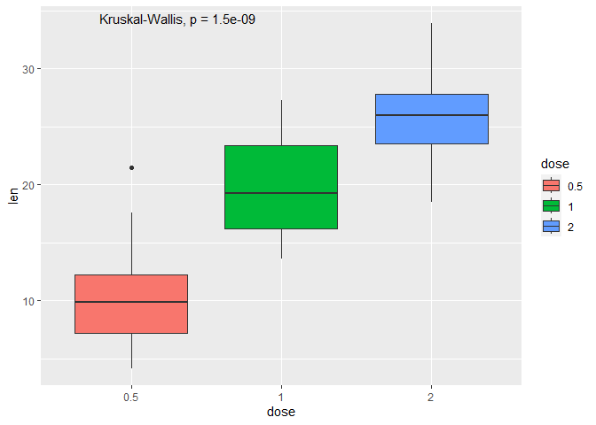
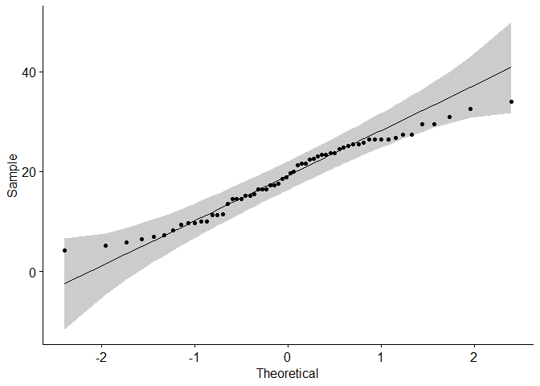
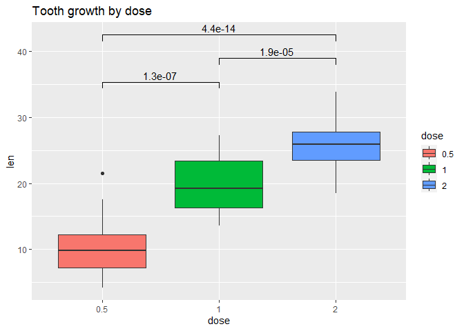
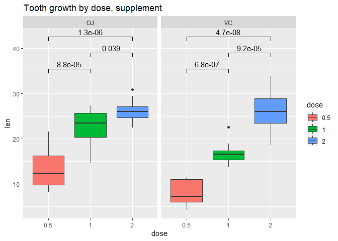
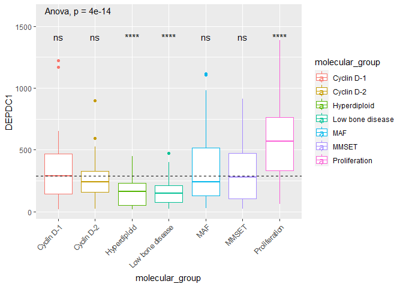
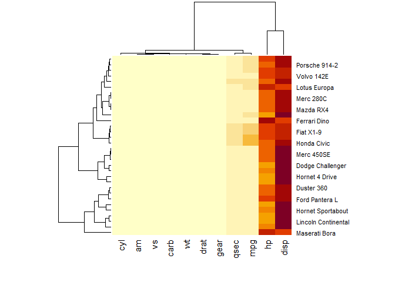
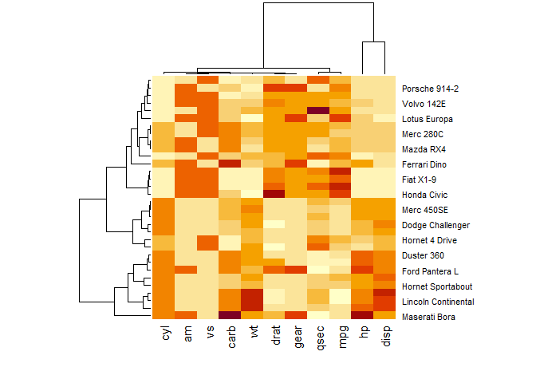
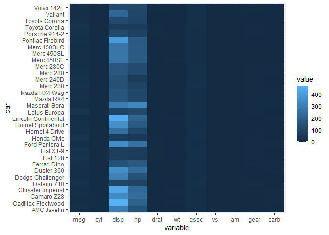
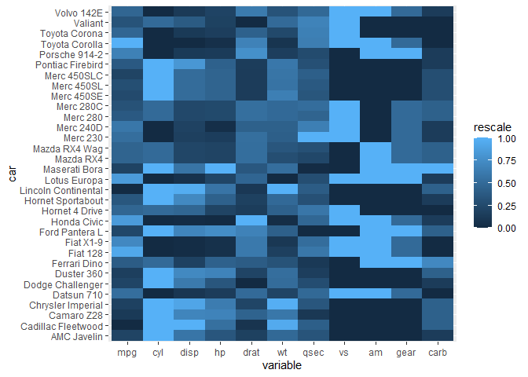
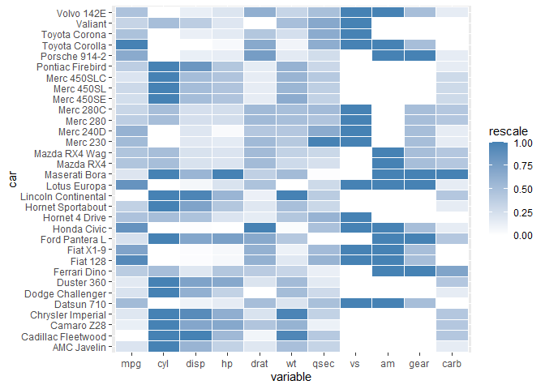

ggplot2_workshop_part2
================
2024-05-06

# Welcome

Reminders of some useful hotkey Mac shortcuts:

cmd+opt+i = insert code chunk (ctrl+opt+i on Windows) opt+- = insert
left arrow

## Adding in statistical analysis

ggplot2 has a built-in function that you can call to add in automatic
statistical analysis to your graphs. You will need to determine the
appropriate kind of test to perform, but there are several means
comparison tests available in the ‘method’ argument defaults including t
test, Wilcoxon rank-sum, Kruskal-Wallis, and more. The “toothgrowth”
dataset we are using is built into R so there is no need to load it in.

``` r
# Convert the variable dose from a numeric to a factor variable
ToothGrowth$dose <- as.factor(ToothGrowth$dose)
head(ToothGrowth)
```

    ##    len supp dose
    ## 1  4.2   VC  0.5
    ## 2 11.5   VC  0.5
    ## 3  7.3   VC  0.5
    ## 4  5.8   VC  0.5
    ## 5  6.4   VC  0.5
    ## 6 10.0   VC  0.5

``` r
ggplot(ToothGrowth, aes(x=dose, y=len, fill = dose)) +
  geom_boxplot() +
  stat_compare_means()
```

<!-- -->

The default test for multiple groups is a Kruskal-Wallis test, which is
a nonparametric alternative to an ANOVA that can be used to compare
differences between means of multiple groups.

What if we want to see specifically how dose 0.5 and 1 compare to each
other, for example?

## Stats review

This time we’ll use a t-test. First we will check that our data meets
the assumptions required for a t test (does it follow a normal
distribution?)

This is generally a good idea to do with your data so that you know you
can trust your results and you are using the right test. However, this
may also depend on where your data is coming from. Generally, if you
have over 30 samples to compare, you can ignore the distribution of the
data and use a parametric test because of the central limit theorem.

Here we are going to start with a Q-Q plot, or quantile-quantile plot.
This is a visual check to see whether there is a correlation between a
given sample and the normal distribution.

``` r
ggqqplot(ToothGrowth$len)
```

<!-- -->
Visually, this looks good. Let’s do a significance test as well. There
are a few ways you can do this - using a Kolmogorow-Smirnov (KS)
normality test, or a Shapiro-Wilks test. For both of these, the null
hypothesis is that the sample distribution is normal. Therefore if it is
significant, we can reject the null hypothesis and say that the data is
not normal.

``` r
shapiro.test(ToothGrowth$len)
```

    ## 
    ##  Shapiro-Wilk normality test
    ## 
    ## data:  ToothGrowth$len
    ## W = 0.96743, p-value = 0.1091

Not significant, which is great in this case! So we can accept the null
hypothesis and use the t-test to compare each group.

``` r
dose_comparisons <- list(c("0.5", "1"), c("1", "2"), c("0.5", "2")) #make a list with the things you want to compare

ggplot(ToothGrowth, aes(x=dose, y=len, fill = dose)) +
  geom_boxplot() +
  stat_compare_means(comparisons = dose_comparisons, method = "t.test") +
  ggtitle("Tooth growth by dose")
```

<!-- -->

Let’s add in a facet to get some more information about our data. We
want to check if there are differences between the OJ and VC supplement
groups.

``` r
ggplot(ToothGrowth, aes(x=dose, y=len, fill = dose)) +
  geom_boxplot() +
  facet_wrap(~supp) +
  stat_compare_means(comparisons = dose_comparisons, method = "t.test") +
  ggtitle("Tooth growth by dose, supplement")
```

<!-- -->

## More advanced

Let’s take this myeloma dataset and plot expression profiles of the
DEPDC1 gene according to patient molecular group.

Question: does the expression profile of this gene differ between
groups?

You could start with a pairwise comparison (every group is compared to
every other group) but this can get difficult to interpret since there
are so many groups.

``` r
myeloma <- read.delim("https://raw.githubusercontent.com/kassambara/data/master/myeloma.txt")

compare_means(DEPDC1 ~ molecular_group, data = myeloma,
              method = "t.test")
```

    ## # A tibble: 21 × 8
    ##    .y.    group1     group2                   p   p.adj p.format p.signif method
    ##    <chr>  <chr>      <chr>                <dbl>   <dbl> <chr>    <chr>    <chr> 
    ##  1 DEPDC1 Cyclin D-1 Cyclin D-2       0.178     1       0.17845  ns       T-test
    ##  2 DEPDC1 Cyclin D-1 MMSET            0.483     1       0.48343  ns       T-test
    ##  3 DEPDC1 Cyclin D-1 MAF              0.873     1       0.87321  ns       T-test
    ##  4 DEPDC1 Cyclin D-1 Hyperdiploid     0.00979   0.12    0.00979  **       T-test
    ##  5 DEPDC1 Cyclin D-1 Proliferation    0.0209    0.19    0.02087  *        T-test
    ##  6 DEPDC1 Cyclin D-1 Low bone disease 0.00856   0.11    0.00856  **       T-test
    ##  7 DEPDC1 Cyclin D-2 MMSET            0.297     1       0.29664  ns       T-test
    ##  8 DEPDC1 Cyclin D-2 MAF              0.164     1       0.16357  ns       T-test
    ##  9 DEPDC1 Cyclin D-2 Hyperdiploid     0.00246   0.037   0.00246  **       T-test
    ## 10 DEPDC1 Cyclin D-2 Proliferation    0.0000108 0.00021 1.1e-05  ****     T-test
    ## # ℹ 11 more rows

We can also use a base mean as the reference group - so all group means
are compared to a base mean of all groups.

``` r
compare_means(DEPDC1 ~ molecular_group,  data = myeloma,
              ref.group = ".all.", method = "t.test")
```

    ## # A tibble: 7 × 8
    ##   .y.    group1 group2                      p     p.adj p.format p.signif method
    ##   <chr>  <chr>  <chr>                   <dbl>     <dbl> <chr>    <chr>    <chr> 
    ## 1 DEPDC1 .all.  Cyclin D-1       0.288          1   e+0 0.29     ns       T-test
    ## 2 DEPDC1 .all.  Cyclin D-2       0.424          1   e+0 0.42     ns       T-test
    ## 3 DEPDC1 .all.  MMSET            0.578          1   e+0 0.58     ns       T-test
    ## 4 DEPDC1 .all.  MAF              0.254          1   e+0 0.25     ns       T-test
    ## 5 DEPDC1 .all.  Hyperdiploid     0.0000000273   1.9 e-7 2.7e-08  ****     T-test
    ## 6 DEPDC1 .all.  Proliferation    0.0000239      1.2 e-4 2.4e-05  ****     T-test
    ## 7 DEPDC1 .all.  Low bone disease 0.00000526     3.20e-5 5.3e-06  ****     T-test

Much easier to read. So we find that there are 3 groups that deviate
significantly from the mean: hyperdiploid, proliferation, and low bone
disease. Now that we know that they differ we can visualize them to
check directionality.

``` r
ggplot(data = myeloma, aes(x = molecular_group, y = DEPDC1, color = molecular_group, add = "jitter", legend = "none")) +
  geom_boxplot() +
  rotate_x_text(angle = 45) +
  geom_hline(yintercept = mean(myeloma$DEPDC1), linetype = 2)+ # Add horizontal line at base mean
  stat_compare_means(method = "anova", label.y = 1600)+        # Add global annova p-value
  stat_compare_means(label = "p.signif", method = "t.test",
                     ref.group = ".all.")                      # Pairwise comparison against all
```

<!-- --> So now
we can see that hyperdiploid and low bone disease subjects have lower
expression of this gene, whereas the proliferation group has increased
expression compared to the mean.

## Heatmaps

Heatmaps can be great visualization tools to identify patterns in large
datasets.

You must have your data in a matrix format with numeric variables.
Convert these formats prior to making your heatmap.

We’ll use the mtcars dataset here, another dataset built into R for
practicing.

``` r
str(mtcars)
```

    ## 'data.frame':    32 obs. of  11 variables:
    ##  $ mpg : num  21 21 22.8 21.4 18.7 18.1 14.3 24.4 22.8 19.2 ...
    ##  $ cyl : num  6 6 4 6 8 6 8 4 4 6 ...
    ##  $ disp: num  160 160 108 258 360 ...
    ##  $ hp  : num  110 110 93 110 175 105 245 62 95 123 ...
    ##  $ drat: num  3.9 3.9 3.85 3.08 3.15 2.76 3.21 3.69 3.92 3.92 ...
    ##  $ wt  : num  2.62 2.88 2.32 3.21 3.44 ...
    ##  $ qsec: num  16.5 17 18.6 19.4 17 ...
    ##  $ vs  : num  0 0 1 1 0 1 0 1 1 1 ...
    ##  $ am  : num  1 1 1 0 0 0 0 0 0 0 ...
    ##  $ gear: num  4 4 4 3 3 3 3 4 4 4 ...
    ##  $ carb: num  4 4 1 1 2 1 4 2 2 4 ...

``` r
cars <- as.matrix(mtcars)
str(cars)
```

    ##  num [1:32, 1:11] 21 21 22.8 21.4 18.7 18.1 14.3 24.4 22.8 19.2 ...
    ##  - attr(*, "dimnames")=List of 2
    ##   ..$ : chr [1:32] "Mazda RX4" "Mazda RX4 Wag" "Datsun 710" "Hornet 4 Drive" ...
    ##   ..$ : chr [1:11] "mpg" "cyl" "disp" "hp" ...

``` r
#default

heatmap(cars)
```

<!-- -->

Difficult to read here because of high hp and disp variables. Let’s
normalize.

``` r
heatmap(cars, scale = "column") # scale by the value in the column - this provides a log transformation
```

<!-- --> Much
better!

We can also use ggplot to make a heatmap.

Ggplot needs a dataframe, not a matrix SO we will import the original
dataframe. We will also need to reshape the data to get it into long
format instead of wide.

``` r
cars.data <- mtcars 
cars.melt <- reshape2::melt(cars.data)
```

    ## No id variables; using all as measure variables

``` r
#take a peek
head(cars.melt) # now it's in long format
```

    ##   variable value
    ## 1      mpg  21.0
    ## 2      mpg  21.0
    ## 3      mpg  22.8
    ## 4      mpg  21.4
    ## 5      mpg  18.7
    ## 6      mpg  18.1

``` r
#add in a column for car names
cars.melt$car <- rep(row.names(cars.data), 11) #repeats 11 times

ggplot(cars.melt, aes(variable, car)) +
  geom_tile(aes(fill = value))
```

<!-- -->

We still need to rescale. ggplot2 doesn’t do this natively so we’ll use
the reshape2 package again.

``` r
library(scales)
library(plyr)
#rescale values for all variables in melted data frame
cars.melt <- ddply(cars.melt, .(variable), transform, rescale = rescale(value))
head(cars.melt)
```

    ##   variable value               car   rescale
    ## 1      mpg  21.0         Mazda RX4 0.4510638
    ## 2      mpg  21.0     Mazda RX4 Wag 0.4510638
    ## 3      mpg  22.8        Datsun 710 0.5276596
    ## 4      mpg  21.4    Hornet 4 Drive 0.4680851
    ## 5      mpg  18.7 Hornet Sportabout 0.3531915
    ## 6      mpg  18.1           Valiant 0.3276596

``` r
#this adds in a new column with the rescaled/normalized value that we transformed.

ggplot(cars.melt, aes(variable, car)) +
  geom_tile(aes(fill = rescale))
```

<!-- -->

We can also specify our color gradient.

``` r
ggplot(cars.melt, aes(variable, car)) +
  geom_tile(aes(fill = rescale), colour = "white") +
  scale_fill_gradient(low = "white", high = "steelblue")
```

<!-- -->

Cool!
